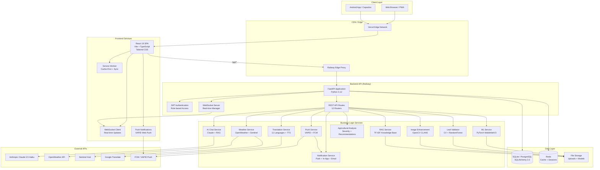
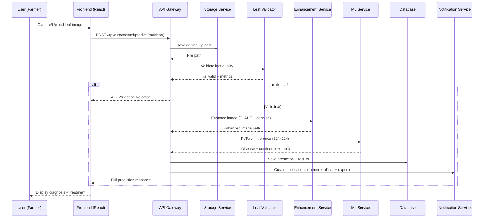
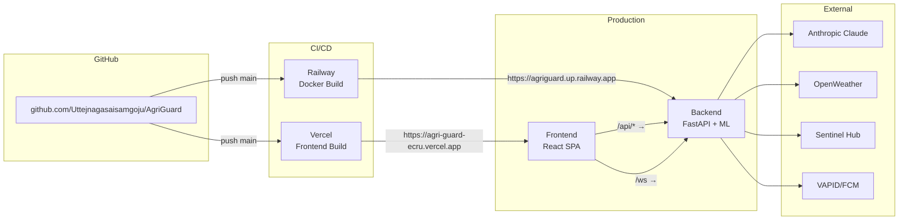
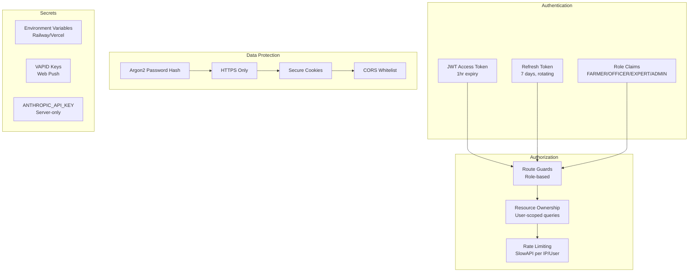
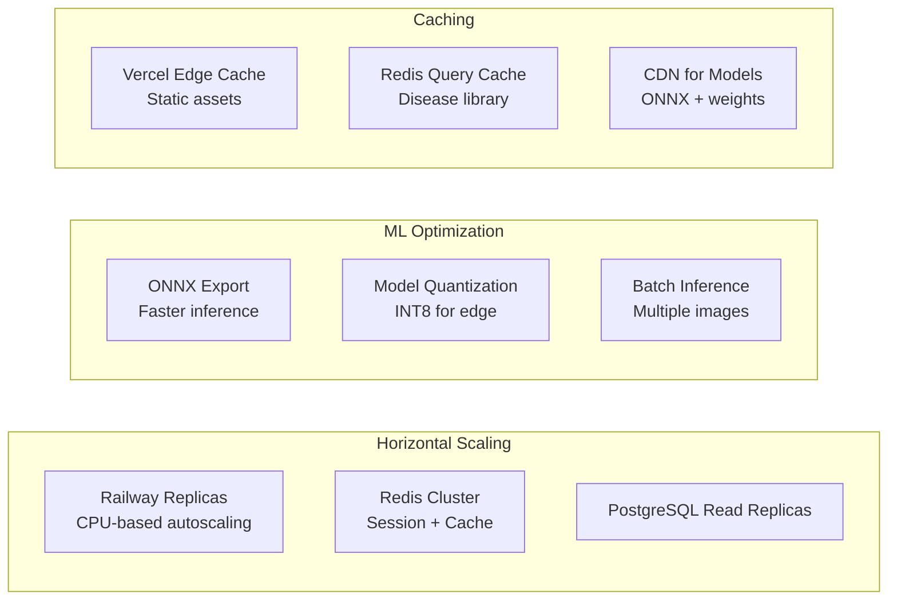
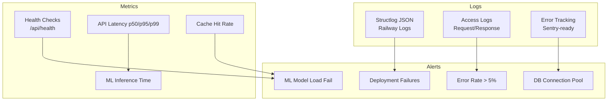

# AgriGuard Architecture Diagram

## System Overview

---

## Data Flow: Disease Detection

---

## Deployment Topology

---

## Security Architecture

---

## Scalability Considerations

---

## Monitoring & Observability

